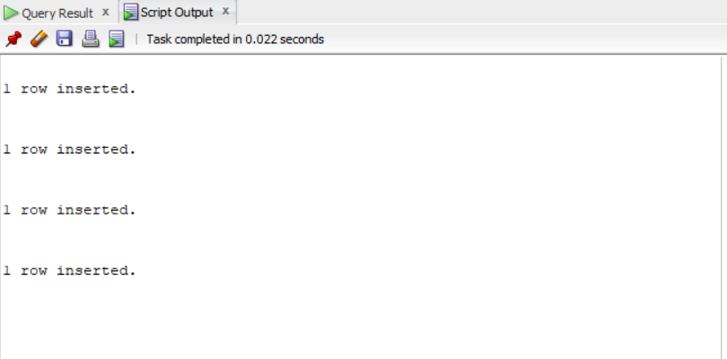
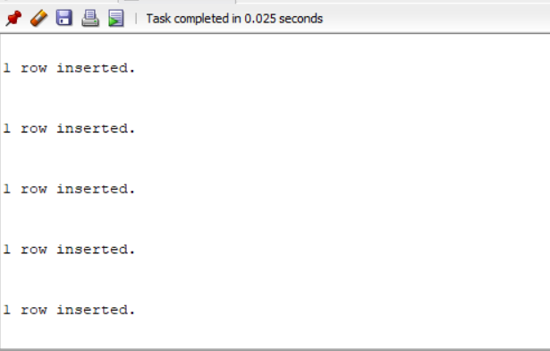
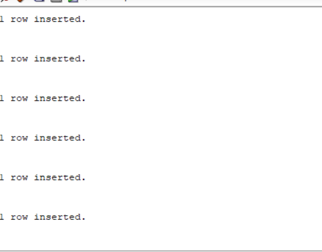

#list of tables
```
INSERT INTO student
VALUES('Smith',17,1,'CS');
INSERT INTO student
VALUES('Brown',18,2,'CS');
```

```
INSERT INTO course
VALUES('Intro to computer science','CS3320',4,'CS');
INSERT INTO course
VALUES('Data structures','CS3320',4,'CS');
INSERT INTO course
VALUES('Discrete mathematics','MATH2410',3,'MATH');
INSERT INTO course
VALUES('Database','CS3380',3,'CS');
```

```
INSERT INTO section
VALUES(85,'MATH2410','Fall',7,'King');
INSERT INTO section
VALUES(92,'CS1310','Fall',7,'Anderson');
INSERT INTO section
VALUES(102,'CS3320','Spring',8,'Knuth');
INSERT INTO section
VALUES(112,'MATH2410','Fall',8,'Chang');
INSERT INTO section
VALUES(119,'CS1310','Fall',8,'Anderson');
```

```
INSERT INTO grade_report
VALUES(17,112,'B');S
INSERT INTO grade_report
VALUES(17,119,'B');
INSERT INTO grade_report
VALUES(8,85,'A');
INSERT INTO grade_report
VALUES(8,92,'A');
INSERT INTO grade_report
VALUES(8,102,'B');
INSERT INTO grade_report
VALUES(8,135,'A');
```

