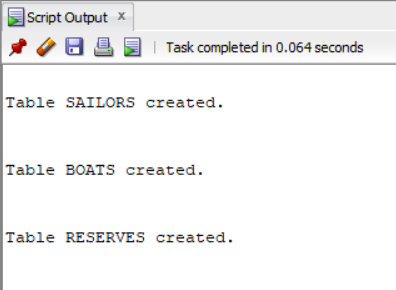

# create tables
```
CREATE TABLE sailors(
sid NUMBER,
sname VARCHAR2(40),
rating NUMBER,
age NUMBER (4,1)
);
CREATE TABLE boats (
bid NUMBER,
bname VARCHAR2(20),
color VARCHAR2(10)
);
CREATE TABLE reserves (
sid NUMBER,
bid NUMBER,
day DATE
);
```


